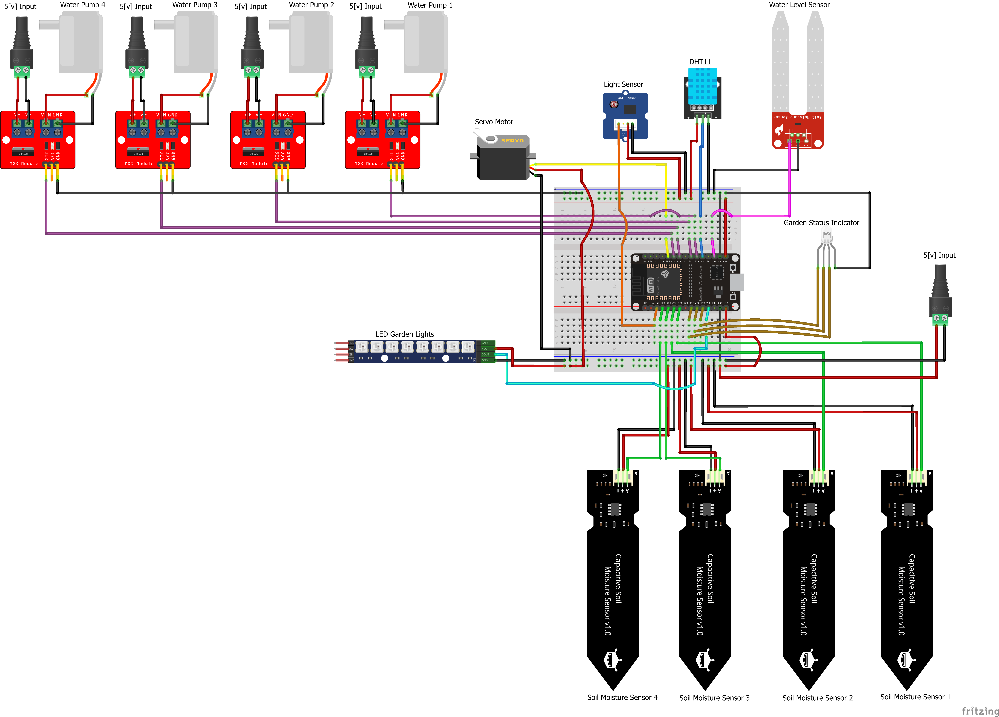

# Smart Garden Project

### By:
- Dolev Nissan  
- Shahar Kadosh  
- Yael Chubar  

## Project Overview
The Smart Garden Project automates plant care with minimal manual intervention. Using an ESP32-based system, it ensures optimal plant growth in just three simple steps:

1️⃣ **Set up your plant profiles** – Specify the requirements of each plant, such as the ideal soil moisture level and whether it needs direct sunlight.

2️⃣ **Calibrate the sensors** – Make sure soil moisture readings are accurate.

3️⃣ **Monitor your garden** – Use a mobile app to track real-time data and system status.  

## Features
The Smart Garden supports three modes of operation:
- **Automatic Mode** – The system autonomously controls irrigation and monitoring based on sensor data.
- **Manual Mode** – Users can manually control irrigation and other settings via the mobile app.
- **Offline Mode** – The system continues to operate autonomously even without an internet connection.

### Key Features:
- **Wi-Fi Enrollment using WifiManager** – Easily set up and connect the system to a Wi-Fi network.
- **Moisture Sensor Calibration** – Ensures accurate soil moisture readings for efficient watering.
- **Automatic Irrigation** – Watering is triggered based on real-time moisture levels.
- **Cover to Prevent Direct Sun Exposure** – Protects sensitive components from overheating.
- **Handshake Protocol for Android App Communication** – Enables reliable data exchange between the ESP32 and the mobile application.
- **RGB Light Status Indicator** – Provides visual feedback on system status.

## Folder Description
- **project/** – Source code for the ESP32 firmware.
- **Documentation/** – Wiring diagram + calibration workflow diagram.
- **UnitTests/** – Tests for individual hardware components (input/output devices).

## Hardware Requirements
- **ESP32** - devkit V1
- **4 Capacitive soil moisture sensor** - v2.0
- **DHT11 temperature / humisity sensor**
- **Light sensor**
- **RGB indicator LED**
- **4-channel mosfet board** (for water pumps)
- **4 water pumps**
- **USB power source**
- **Led strip**
- **servo motor MG995**
- **Capacitive water level sensor**

## Arduino/ESP Libraries Installed for the Project
- **WifiManager** – Version 2.0.17
- **Firebase_ESP_Client** – Version 4.4.15
- **Adafruit NeoPixel** – Version 1.12.0
- **DFRobot_DHT11** – Version 1.0.0

## Wiring Diagram

## Project Poster
Will be added

## Acknowledgment
This project is part of **ICST - The Interdisciplinary Center for Smart Technologies** at the **Taub Faculty of Computer Science, Technion**.

🔗 [ICST Website](https://icst.cs.technion.ac.il/)

